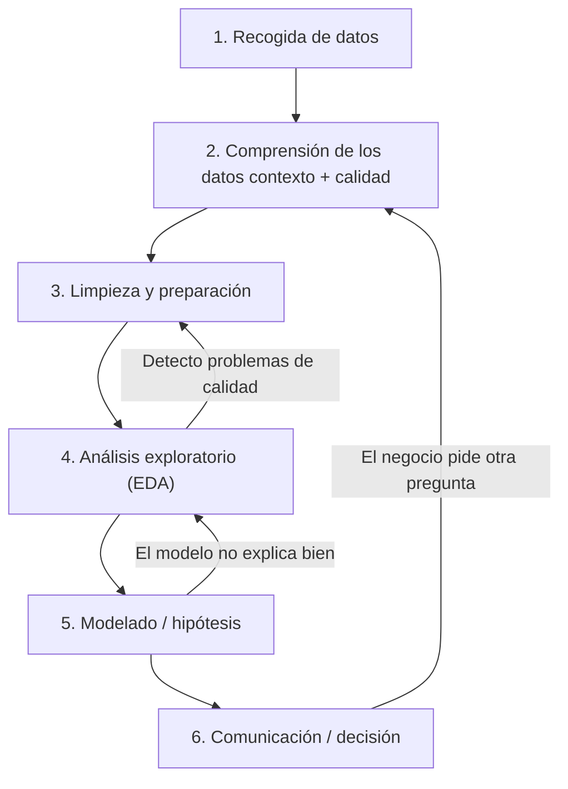

# Introducción  Análisis de Datos

## 0. Diagrama inicial para el análsis de datos



## 1. Introducción al entorno de trabajo

### 1.1 Instalación de librerías
El primer paso en cualquier entorno de análisis de datos consiste en preparar las herramientas necesarias.
Las librerías como NumPy, Pandas, Matplotlib y Seaborn proporcionan funciones especializadas para el manejo de datos, cálculos matemáticos y visualización.

```bash
pip install jupyter numpy pandas matplotlib seaborn
```

### 1.2 Lanzar Jupyter Notebook
Jupyter Notebook es una interfaz interactiva que permite combinar texto, ecuaciones, visualizaciones y código en un mismo documento.

```bash
jupyter notebook
```

### 1.3 Importación de librerías
Importar librerías consiste en hacer accesibles sus funciones dentro de nuestro proyecto.

```python
import numpy as np
import pandas as pd
import matplotlib.pyplot as plt
import seaborn as sns
```

## 2. Fundamentos de NumPy

### 2.1 Qué es NumPy
NumPy permite manejar grandes volúmenes de datos de forma eficiente mediante estructuras llamadas arrays, que soportan operaciones matemáticas vectorizadas.

```python
import numpy as np
```

### 2.2 Creación de arrays
Los arrays son estructuras que almacenan datos homogéneos (del mismo tipo) y permiten realizar operaciones matemáticas de manera optimizada.

```python
a = np.array([1, 2, 3, 4])
b = np.arange(0, 10, 2)
#np.linspace() crea un array con números igualmente espaciados dentro de un intervalo.
c = np.linspace(0, 1, 5)
#np.random.randint() genera números enteros aleatorios dentro de un rango determinado.
d = np.random.randint(0, 100, size=(3, 3))
```

### 2.3 Propiedades de los arrays
Cada array posee atributos que describen su estructura: número de dimensiones, forma, tipo de dato y número de elementos.

```python
print(a.shape)
print(a.ndim)
print(a.dtype)
print(a.size)
```

### 2.4 Indexación y slicing
La indexación y el slicing permiten acceder a partes específicas de los datos, lo que resulta útil para analizar subconjuntos sin copiar toda la estructura.

```python
a = np.array([10, 20, 30, 40, 50])
print(a[0])
print(a[1:4])
```

### 2.5 Operaciones vectorizadas
NumPy permite aplicar operaciones matemáticas sobre conjuntos de datos completos sin necesidad de bucles explícitos.

```python
x = np.array([1, 2, 3])
y = np.array([10, 20, 30])
print(x + y)
print(x * y)
print(np.mean(y))
```

### 2.6 Álgebra lineal
El álgebra lineal permite realizar cálculos matriciales como productos, determinantes o inversas, esenciales en análisis de datos, modelos y simulaciones.

```python
A = np.array([[1, 2], [3, 4]])
B = np.array([[2, 0], [1, 2]])
print(np.dot(A, B))
print(np.linalg.det(A))
print(np.linalg.inv(A))
```

### 2.7 Broadcasting
El broadcasting permite realizar operaciones entre estructuras de diferente tamaño, extendiendo automáticamente los datos cuando sea posible.

```python
A = np.array([[1, 2, 3],
              [4, 5, 6]])
b = np.array([10, 20, 30])
print(A + b)
```

## 3. Estructuras de datos con Pandas

### 3.1 Qué es Pandas
Pandas facilita el manejo de datos estructurados (tablas, registros, hojas de cálculo) mediante objetos optimizados para análisis y limpieza.

```python
import pandas as pd
```

### 3.2 Creación básica
Las Series y los DataFrames son las estructuras fundamentales de Pandas, que permiten representar columnas y tablas completas respectivamente.

```python
s = pd.Series([10, 20, 30], index=['a', 'b', 'c'])
data = {'Nombre': ['Ana', 'Luis', 'María'],
        'Edad': [23, 31, 29],
        'Ciudad': ['Madrid', 'Sevilla', 'Bilbao']}
df = pd.DataFrame(data)
```

### 3.3 Lectura y escritura de datos
Permite importar y exportar información desde distintos formatos (CSV, Excel, JSON...), conectando el entorno analítico con los datos reales.

```python
df = pd.read_csv("screentime_analysis_extended.csv")
df.to_csv("salida.csv", index=False)
```

### 3.4 Inspección general
Antes de analizar, es importante conocer la estructura, tamaño y calidad del dataset.

```python
df.head()
df.info()
df.describe()
df.shape
```

### 3.5 Selección y filtrado
Seleccionar o filtrar datos permite enfocar el análisis en variables y registros específicos.

```python
df['columna']
df.loc[0:5, ['Edad']]
df.iloc[0:5, 1:3]
df[df['Edad'] > 25]
```

### 3.6 Ordenación y reindexación
Ordenar los datos facilita la comparación y el análisis, mientras que reindexar reorganiza el DataFrame de forma coherente.

```python
df.sort_values(by='Edad', ascending=False)
df.reset_index(drop=True)
```

### 3.7 Operaciones con columnas
Pandas permite generar nuevas variables, realizar cálculos o aplicar funciones sobre las columnas existentes.

```python
df['Edad+5'] = df['Edad'] + 5
df['Grupo'] = df['Edad'].apply(lambda x: 'Joven' if x < 30 else 'Adulto')
```

### 3.8 Limpieza de datos
La limpieza garantiza que los datos sean coherentes y utilizables, eliminando duplicados o valores ausentes.

```python
df.drop_duplicates(inplace=True)
df.dropna(inplace=True)
df.fillna(0, inplace=True)
df['columna'] = df['columna'].astype(float)
```

### 3.9 Combinación de DataFrames
La combinación permite integrar información de distintas fuentes en un único conjunto de datos.

```python
pd.concat([df1, df2])
pd.merge(df1, df2, on='id', how='inner')
df.groupby('Ciudad')['Edad'].mean()
```

## 4. Visualización con Matplotlib y Seaborn

### 4.1 Gráficos básicos
Los gráficos permiten traducir los datos numéricos en información visual, haciendo evidentes tendencias y patrones.

```python
x = [1, 2, 3, 4]
y = [10, 20, 25, 30]
plt.plot(x, y)
plt.title("Ejemplo de gráfico")
plt.xlabel("Eje X")
plt.ylabel("Eje Y")
plt.show()
```

### 4.2 Gráficos con Seaborn
Seaborn permite crear gráficos estadísticos con una estética más cuidada y un enfoque más interpretativo.

```python
sns.histplot(df['Edad'])
sns.boxplot(x='Ciudad', y='Edad', data=df)
sns.scatterplot(x='Altura', y='Peso', data=df)
```

### 4.3 Personalización
Adaptar el estilo visual de los gráficos mejora la comunicación de resultados.

```python
plt.style.use('seaborn-v0_8')
sns.set_palette('pastel')
```

## 5. Análisis exploratorio del dataset screentime_analysis_extended.csv

Archivos de ejemplo:

- [Archivo ipynb](AnalisisScreenTime.ipynb)

- [Archivos datos ejemplo](screentime_analysis_extended.csv)

### 5.1 Carga del dataset
Cargar los datos es el punto de partida para cualquier análisis. Permite obtener una primera visión del contenido y su estructura.

```python
df = pd.read_csv("screentime_analysis_extended.csv")
df.head()
```

### 5.2 Inspección
La inspección inicial busca conocer las características generales y detectar posibles problemas en los datos.

```python
df.info()
df.describe()
df.isna().sum()
```

### 5.3 Limpieza básica
La limpieza prepara los datos para un análisis riguroso, eliminando duplicados o corrigiendo valores ausentes.

```python
df.drop_duplicates(inplace=True)
df.dropna(subset=['ScreenTime'], inplace=True)
```

### 5.4 Análisis exploratorio
Consiste en examinar las relaciones entre variables, calcular promedios y detectar patrones relevantes.

```python
media_dia = df.groupby('Date')['ScreenTime'].mean()
top_usuarios = df.groupby('User')['ScreenTime'].mean().sort_values(ascending=False)
```

### 5.5 Visualización de tendencias
La visualización temporal o comparativa facilita la comprensión de la evolución o las diferencias entre grupos.

```python
sns.lineplot(x='Date', y='ScreenTime', data=df)
plt.title("Evolución del tiempo de pantalla")
plt.show()
```

### 5.6 Correlaciones
El análisis de correlaciones permite detectar qué variables presentan relación entre sí, útil en análisis predictivos.

```python
sns.heatmap(df.corr(numeric_only=True), annot=True, cmap='coolwarm')
```

### 5.7 Conclusiones
El análisis exploratorio culmina con la interpretación de los resultados y la formulación de hipótesis basadas en los datos.
