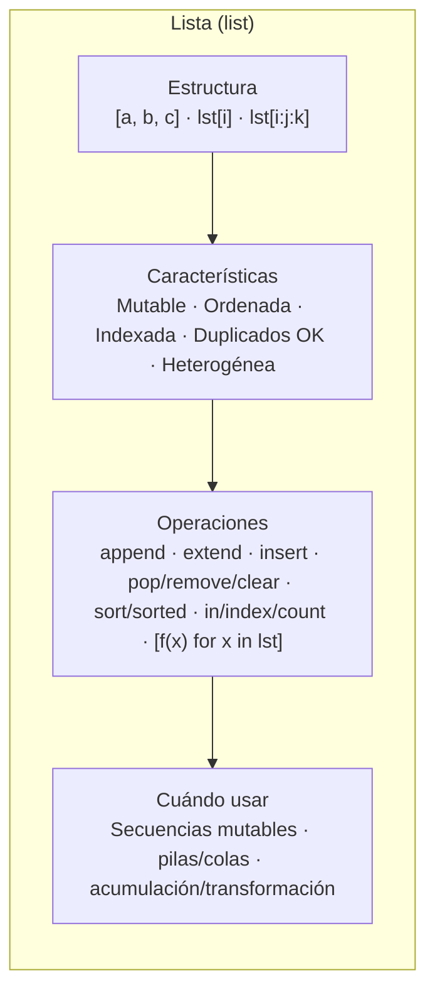
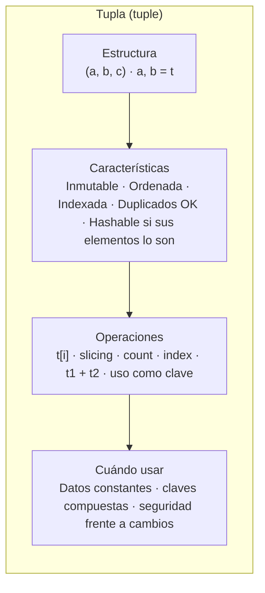
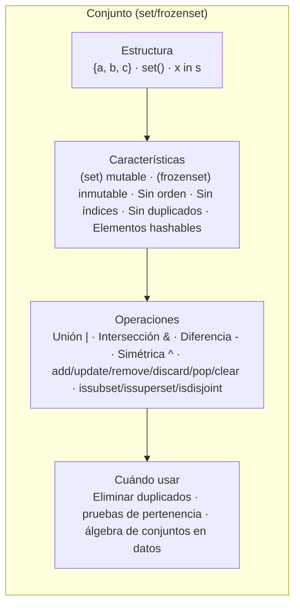
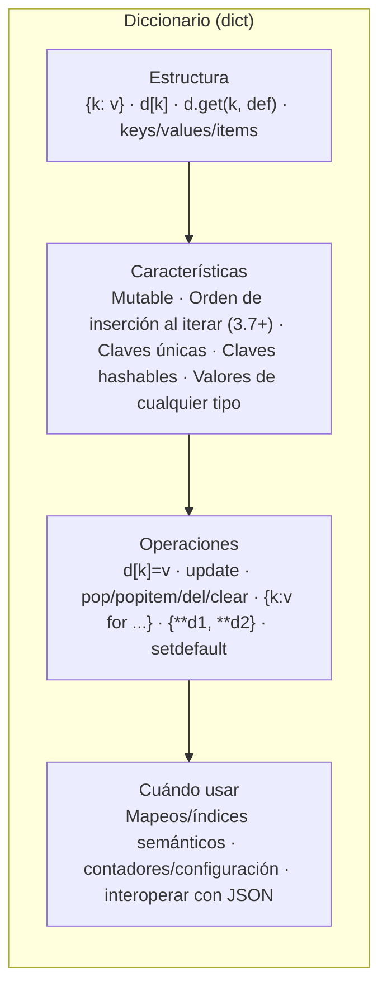
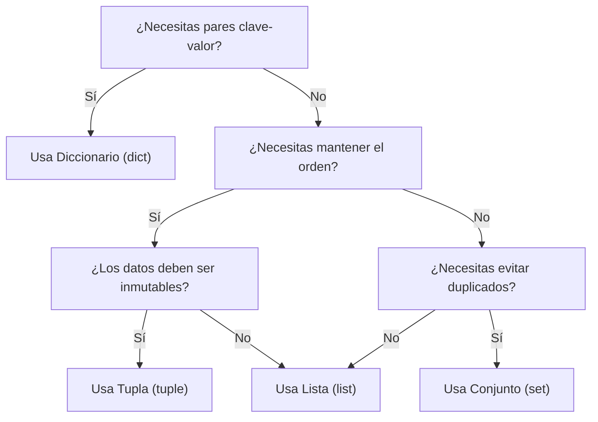

# Unidad: **Colecciones de Datos en Python**

## Objetivos de la unidad

- Conocer y manipular listas, tuplas, conjuntos y diccionarios.  
- Usar operaciones básicas de inserción, búsqueda y borrado.  
- Crear listas dinámicas con *list comprehensions*.  

---

## Contenidos

### 1. Listas

Las listas (`list`) son secuencias **mutables** que permiten almacenar cualquier tipo de dato y cuyo tamaño puede crecer o disminuir dinámicamente. Los índices comienzan en `0` y se admiten índices negativos para contar desde el final (`-1` es el último elemento). Además de acceder a un elemento concreto, el *slicing* (`lista[inicio:fin:paso]`) permite extraer sublistas sin bucles explícitos.

**Operaciones principales**

- **Añadir elementos**: `append(x)` agrega `x` al final; `extend(iterable)` concatena otra colección; `insert(i, x)` inserta `x` antes del índice `i`.  
- **Eliminar elementos**: `remove(x)` borra la primera ocurrencia de `x` y lanza un error si no existe; `pop([i])` extrae y devuelve el elemento de la posición `i` (por defecto, el último); `clear()` vacía la lista.  
- **Reordenar**: `sort()` ordena la lista en su lugar (acepta argumentos `key` y `reverse`), mientras que `sorted(lista)` devuelve una nueva lista ordenada. `reverse()` invierte el orden de los elementos.  
- **Buscar y contar**: `index(x)` devuelve la posición de la primera aparición de `x`; `count(x)` devuelve cuántas veces aparece `x`.  
- **Copiar**: `lista.copy()` o `lista[:]` devuelve una copia superficial.
- **Rebanado (slicing)**: lista[inicio:fin:paso] devuelve una sublista. Se pueden omitir inicio o fin, usar índices negativos para contar desde el final y especificar un paso distinto de 1 para saltar elementos o invertir el orden.



**Ejemplo**

```python
# Crear y modificar una lista
numeros = [10, 5, 7, 3, 8]
numeros.append(2)          # [10, 5, 7, 3, 8, 2]
numeros.insert(2, 9)       # [10, 5, 9, 7, 3, 8, 2]
ultimo = numeros.pop()     # extrae 2, lista = [10, 5, 9, 7, 3, 8]
numeros.remove(7)          # [10, 5, 9, 3, 8]

# Ordenar
ordenados = sorted(numeros)    # [3, 5, 8, 9, 10] (copia ordenada)
numeros.sort(reverse=True)     # lista original ahora es [10, 9, 8, 5, 3]
print(numeros, ordenados)
`
# Slicing
primeros_tres = numeros[:3]        # [10, 9, 8]
ultimos_dos = numeros[-2:]         # [5, 3]
saltos_de_dos = numeros[::2]       # [10, 8, 3]
invertida = numeros[::-1]          # [3, 5, 8, 9, 10]

sublista = numeros[1:4]            # [9, 8, 5]

print(numeros)
print("Ordenados:", ordenados)
print("Primeros tres:", primeros_tres)
print("Últimos dos:", ultimos_dos)
print("Saltos de dos:", saltos_de_dos)
print("Invertida:", invertida)
print("Sublista [1:4]:", sublista)
```

### 2. Tuplas

Las tuplas (tuple) son secuencias inmutables: una vez creadas, no se pueden añadir ni eliminar elementos. Son útiles para agrupar datos heterogéneos que no deben cambiar (coordenadas, fechas, etc.) y pueden utilizarse como claves en diccionarios al ser objetos hashables.

Python permite desempaquetar una tupla en múltiples variables y convertirla a lista si se necesita modificarla.



```python
punto = (4, 5)
x, y = punto      # desempaquetado

# Tuplas como claves
coordenadas = {(0, 0): "origen", (1, 2): "punto A"}
print(coordenadas[(1, 2)])  # "punto A"

# Conversión para modificar
lista_punto = list(punto)
lista_punto[0] = 10
punto_modificado = tuple(lista_punto)  # (10, 5)

```

🔹 Inmutables → no se pueden modificar tras crearlas.

### 3. Conjuntos (set)

Un conjunto (set) es una colección no ordenada y sin elementos duplicados. Se utiliza para eliminar duplicados, comprobar pertenencia rápidamente y realizar operaciones de teoría de conjuntos. Para crear un conjunto vacío se usa set(), ya que {} crea un diccionario.

**Operaciones principales**

- Agregar o quitar: add(x) inserta x; remove(x) elimina x y lanza error si no existe; discard(x) elimina x si existe; pop() extrae un elemento arbitrario; clear() vacía el conjunto.

- Unión (| o union()): combina elementos de ambos conjuntos.

- Intersección (& o intersection()): elementos comunes a ambos conjuntos.

- Diferencia (- o difference()): elementos presentes en un conjunto pero no en otro.

- Diferencia simétrica (^ o symmetric_difference()): elementos en uno u otro pero no en ambos.



```python
# Ejemplo: uso de conjuntos con horarios de empleados

# Conjunto de empleados que entran de mañana (antes de las 12:00)
turno_mañana = {"María (08-16)", "Juan (09-17)", "Lucía (07-15)", "Ana (08-14)"}

# Conjunto de empleados que entran de tarde (12:00 o después)
turno_tarde = {"Diego (12-20)", "Raúl (12-20)", "Juan (09-17)"}

print("Turno mañana:", turno_mañana)
print("Turno tarde:", turno_tarde)

# Unión: todos los empleados (sin duplicados)
print("\nUnión (mañana ∪ tarde):")
print(turno_mañana | turno_tarde)

# Intersección: empleados que aparecen en ambos turnos (ejemplo de solapamiento)
print("\nIntersección (mañana ∩ tarde):")
print(turno_mañana & turno_tarde)

# Diferencia: empleados solo del turno de mañana
print("\nDiferencia (mañana - tarde):")
print(turno_mañana - turno_tarde)

# Diferencia simétrica: empleados que están en un turno u otro, pero no en ambos
print("\nDiferencia simétrica (mañana Δ tarde):")
print(turno_mañana ^ turno_tarde)

# Operaciones adicionales
print("\n¿Raúl está en el turno de mañana?")
print("Raúl (12-20)" in turno_mañana)

# Ejemplo de eliminación de duplicados automáticamente
horas = {"08", "09", "09", "10"}
print("\nConjunto de horas únicas (sin duplicados):", horas)

```

🔹 No admiten elementos duplicados.

### 4. Diccionarios

Un diccionario (dict) almacena pares clave‑valor. Las claves deben ser únicas e inmutables y se accede a los valores mediante la clave. Los diccionarios son ideales para asociar información y se utilizan frecuentemente en Python (equivalen a los maps en Java o a los arrays asociativos de PHP).

**Operaciones principales**

- Crear y modificar: se define con llaves y pares clave: valor. Se añade o actualiza con dict[clave] = valor.

- Eliminar: del dict[clave] elimina el par; pop(clave) extrae y devuelve el valor; clear() borra todo el diccionario.

- Recorrer: keys() devuelve las claves; values() devuelve los valores; items() devuelve tuplas (clave, valor) para iterar.

- Obtener valor seguro: get(clave, predeterminado) evita errores cuando la clave no existe.

- Ordenar: sorted(diccionario) devuelve una lista de claves ordenadas.

- Comprensiones de diccionario: permiten construir diccionarios de forma concisa.




```python
# Crear un diccionario
persona = {"nombre": "Ana", "edad": 25, "ciudad": "Barcelona"}
persona["edad"] = 26        # actualiza valor
persona["profesion"] = "Ingeniera"  # añade nuevo par

print(persona.get("correo", "sin correo"))  # evita KeyError

# Eliminar
del persona["ciudad"]
edad = persona.pop("edad")

# Recorrer claves y valores
for clave, valor in persona.items():
    print(clave, "->", valor)

# Comprensión de diccionarios
cuadrados = {x: x**2 for x in range(1, 6)}  # {1:1, 2:4, 3:9, 4:16, 5:25}
```

### 5. Comprensiones

Las comprensiones permiten construir colecciones de manera compacta y legible.

- List comprehensions: [expr for elem in iterable if condicion]. Permiten filtrar y transformar elementos.

- Set comprehensions: {expr for elem in iterable} construyen un conjunto.

- Dict comprehensions: {clave_expr: valor_expr for elem in iterable} construyen un diccionario.

```python
# Lista con los cuadrados de los números impares del 0 al 10
impares_cuadrados = [x**2 for x in range(11) if x % 2 != 0]

# Conjunto de vocales únicas en una frase
frase = "Esto es un ejemplo"
vocales = {c.lower() for c in frase if c.lower() in 'aeiou'}

# Diccionario que mapea números pares a su cubo si el cubo > 20
cubos = {x: x**3 for x in range(6) if x % 2 == 0 and x**3 > 20}

print(impares_cuadrados)
print(vocales)
print(cubos)

```

## Comparativa de colecciones

Tabla comparativa con los **usos más comunes** de las colecciones en Python (`list`, `tuple`, `set`, `dict`) y **cuándo conviene utilizarlas**:  

| Colección             | Sintaxis              | Características                                                                 | Cuándo usar |
|-----------------------|-----------------------|---------------------------------------------------------------------------------|-------------|
| **Lista (`list`)**    | `[1, 2, 3]`           | - Ordenada  <br>- Mutable (se pueden añadir, modificar y eliminar elementos) <br>- Permite duplicados | • Guardar datos en orden. <br>• Acceder por posición/índice. <br>• Añadir o quitar elementos frecuentemente. <br>• Permitir duplicados. |
| **Tupla (`tuple`)**   | `(1, 2, 3)`           | - Ordenada  <br>- Inmutable (no se puede modificar después de creada) <br>- Permite duplicados | • Datos que no deben cambiar (constantes, coordenadas, configuraciones). <br>• Usar como clave en un diccionario o elemento en un conjunto. <br>• Mejor rendimiento (más rápida y ligera que lista). |
| **Conjunto (`set`)**  | `{1, 2, 3}`           | - No ordenado  <br>- Mutable (se pueden añadir y eliminar elementos) <br>- **No permite duplicados** | • Eliminar duplicados automáticamente. <br>• Operaciones de conjuntos (unión, intersección, diferencia). <br>• Comprobar existencia rápida (`in`). |
| **Diccionario (`dict`)**| `{"clave": "valor"}`  | - Colección de pares **clave:valor** <br>- Claves únicas (los valores pueden repetirse) <br>- Acceso muy rápido por clave | • Asociar un valor a una clave (como un “índice nombrado”). <br>• Almacenar datos tipo JSON o registros. <br>• Búsquedas rápidas por clave en lugar de índice. |

---

👉 **Regla rápida para elegir:**
- **Lista** → orden y cambios frecuentes.  
- **Tupla** → orden pero sin cambios.  
- **Set** → sin orden, sin duplicados, operaciones de teoría de conjuntos.  
- **Dict** → pares clave-valor con acceso rápido.  


## Diagrama de decisión


